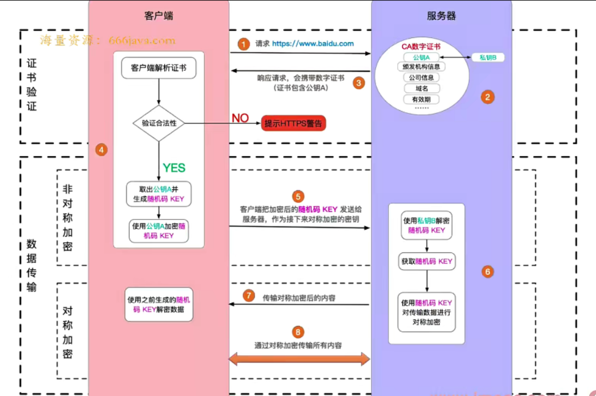

# 前端面试

## 数据结构与算法
+ 什么是复杂度?
  - 程序执行时需要的计算量 (`时间`) 和内存 (`空间`) 空间 **(与代码是否简洁无关)**
  - 复杂度是 **数量级**, 不是具体的数字
  - 一般针对一个具体的算法, 而非一个完整的系统


### 时间复杂度
> 时间复杂度: 程序执行时需要的计算量 (CPU)

1. `O(1)`: 一次就够 (数量级)
2. `O(n)`: 与传输的数据量一样 (数量级)
3. `O(n^2)`: 数据量的平方 (数量级)
4. `O(logn)`: 数据量的对数 (数量级)
5. `O(n*logn)`: 数据量 * 数据量的对数 (数量级)

```js
// O(1)
function O1Fn(obj, key) {
  return obj[key] // O(1)
}

// O(n)
function OnFn(arr) {
  for (let  i = 0; i < arr.length; i++) {
    console.log(arr[i]) // O(n)  
  }
}

// O(n^2)
function OnFn(arr) {
  for (let  i = 0; i < arr.length; i++) {
    for (let  j = 0; j < arr.length; j++) {
      console.log(arr[j]) // O(n^2)
    }
  }
}

// O(logn)
function OLognFn(target, arr) {
  // 二分查找 ... 
}

// O(n * logn)
function OLognFn(target, arr) {
  // for () {
  //   // 二分查找 ...
  // }
}


```

### 空间复杂度

> 空间复杂度: 程序执行时需要的内存空间

1. `O(1)`: 有限的, 可数的空间 (数量级)
2. `O(n)`: 和输入的数据量相同的空间 (数量级)
3. `O(n^2)`: 数据量的平方 (数量级)
4. `O(logn)`: 数据量的对数 (数量级)
5. `O(n*logn)`: 数据量 * 数据量的对数 (数量级)

### 算法题

1. 将一个数组旋转 K 步

```ts
/**
 * 输入一个数组 [1,2,3,4,5,6,7]
 * k = 3, 既旋转 3 步
 * result: [5, 6, 7, 1, 2, 3, 4]
 * */

function rotate1(arr: number[], k: number): number[] {
  const length = arr.length
  if (!k || length === 0) return arr;
  const step = Math.abs(k % length)
  
  for (let i = 0; i < step; i++) {
    const n = arr.pop()
    if (n) {
      arr.unshift(n)
    }
  }
  return arr
}

function rotate2(arr: number[], k: number): number[] {
  const length = arr.length
  if (!k || length === 0) return arr;
  const step = Math.abs(k % length)

  const part1 = arr.slice(-step)
  const part2 = arr.slice(0, length - step)
  const part3 = part1.concat(part2)
  
  return part3
}
```

2. 判断一个字符串是否括号匹配

> 逻辑

```ts
/**
 * 一个字符串 S 可能包含 {} [] () 三种括号
 * 判断 S 是否是括号匹配
 * 如 ([a{b}c])匹配, 而 {a(b{a(b}c) 就不匹配
 * */

function isValid(s: string): boolean {
  const stack = []
  for(let i = 0; i < s.length; i ++) {
    if(stack.length === 0) {
      stack.push(s[i])
    }else {
      let top = stack[stack.length -1]
      if(top === "{" && s[i] === "}") {
        stack.pop()
      }else if(top === "(" && s[i] === ")") {
        stack.pop()
      }else if(top === "[" && s[i] === "]") {
        stack.pop()
      }else {
        stack.push(s[i])
      }
    }

  }
  return stack.length === 0 ? true : false
};
```

3. 使用两个栈实现一个队列

```ts
class MyQueue {
  private  stack1: number[] = []
  private  stack2: number[] = []
  /**
   * 入队
   * @param n n
   * */
  add(n: number) {
    this.stack1.push(n)
  }
  /**
   * 出队
   * */
  delete(): number | null {
    let res;
    const stack1 = this.stack1
    const stack2 = this.stack2

    // 将 stack1 所有元素移动到 stack2 中
    while (stack1.length) {
      const n = stack1.pop()
      if (n !== null) {
        stack2.push(n as number)
      }
    }
    // stack2 pop
    res = stack2.pop()

    // 将 stack2 所有元素 "还给" stack1
    while (stack2.length) {
      const n = stack2.pop()
      if (n !== null) {
        stack1.push(n as number)
      }
    }
    return res || null
  }
  get length(): number {
    return this.stack1.length
  }
}
```

4. 定义一个JS函数, 反转单向链表

> 链表是一种物理结构 (非逻辑结构), **类似**于数组, 数组需要一段连续的内存空间, 而链表是零散的, 链表的数据结构 {value, next?, prev?}

+ 链表 VS 数组
  - 都是有序结构
  - 链表: 查询慢 O(n), 新增和删除快 O(1)
  - 数组: 查询快 O(1), 新增和删除慢 O(n)

```ts
interface ILinkListNode {
  value: number
  next?: ILinkListNode
}

/**
 * 反转单向链表, 并返回反转之后的 head node
 * @param listNode {ILinkListNode} node
 * */
export function reverseLinkList(listNode: ILinkListNode): ILinkListNode {
  // 定义三个指针
  let prevNode: ILinkListNode | undefined = undefined;
  let curNode: ILinkListNode | undefined = undefined;
  let nextNode: ILinkListNode | undefined = listNode;
  // arr [100, 200, 300]
  // { value: 100, next: { value: 200, next: { value: 300 } } }


  // 以 nextNode 为主, 遍历链表
  while (nextNode) {
    // 第一个元素, 删掉 next, 防止循环引用
    if (curNode && !prevNode) {
      delete curNode.next
    }

    // 反转指针
    if (curNode && prevNode) {
      curNode.next = prevNode
    }

    // 整体向后移动
    prevNode = curNode
    curNode = nextNode
    nextNode = nextNode?.next
  }
  curNode!.next = prevNode
  return curNode!
}


/**
 * 根据数组创建单向链表
 * @param arr number arr
 * */
export function createLinkList(arr: number[]): ILinkListNode {
  const length = arr.length;
  if (length === 0) throw new Error("arr is empty");


  // arr: [100, 200, 300]
  // { value: 300 }
  // { value: 200, next: { value: 300 } }
  // { value: 100, next: { value: 200, next: { value: 300 } } }
  let curNode: ILinkListNode = {
    value: arr[length - 1]
  }
  if (length === 1) return curNode

  for (let i = length - 2; i>= 0; i --) {
    curNode = {
      value: arr[i],
      next: curNode
    }
  }

  return curNode
}

```

5. 使用链表实现队列

```ts
interface IListNode {
  value: number,
  next?: IListNode | null
}

export class MyQueue {
  private head: IListNode | null = null
  private tail: IListNode | null = null
  private len: number = 0

  // 入队, 在 tail 位置
  add(n: number) {
    const newNode: IListNode = {
      value: n,
      next: null
    }
    // 处理 head
    if (this.head === null) {
      this.head = newNode
    }
    // 处理 tail
    const tailNode = this.tail
    if (this.tail) {
      tailNode!.next = newNode
    }
    this.tail = newNode
    this.len ++
    }
    // 出队, 在 head 位置
    delete(): number | null {
      const headNode = this.head
      if (headNode === null) return null
      if (this.len <= 0) return null

      // 取值
      const value = headNode.value
      // 处理head
      this.head = headNode.next as IListNode
      // 记录长度
      this.len --

      return  value
    }
    get length(): number {
      // length 要单独存储, 不能通过遍历获取 (复杂时间复杂度太高 O(n))
      return this.len
    }
}
```

6. JS实现二分查找

```ts
export function binarySearch(arr: number[], target: number): number {
  const length = arr.length
  if (length === 0) return -1

  let startIndex = 0 // 开始位置
  let endIndex = length - 1 // 结束位置

  while(startIndex <= endIndex) {
    let midIndex = Math.floor((startIndex + endIndex) / 2)
    let midValue = arr[midIndex]
    // [1,2,3,4,5,6,7,8,9]
    // target 2
    if (target < midValue) {
      // 目标值较小则, 继续在右侧查找
      endIndex = midIndex - 1
    }else if (target > midValue) {
      // 目标值较大则, 继续在左侧查找
      startIndex = midIndex + 1
    }else {
      // 相等, 返回
      return midIndex
    }
  }
  return  -1
}
```

7. 找出一个数组中为n的两个数 (两数之和)

```ts
/**
 * 两数之和 (嵌套循环)
 * @param arr
 * @param n
 * */
// O(n^2)
export function findTwoNumbers1(arr: number[], n: number): number[] {
  const res: number[] = []
  const length = arr.length
  if (length === 0) return res
  for (let i = 0; i < length; i++) {
    const n1 = arr[i]
    let flag = false // 是否得到了结果
    for (let j = i + 1; j < length; j++) {
      const n2 = arr[j]
      if (n1 + n2 === n) {
        res.push(i)
        res.push(j)
        flag = true
        break
      }
    }
    if (flag) break
  }
  return res
}

/**
 * 两数之和 (双指针, 要求有序)
 * @param arr
 * @param n
 * */
export function findTwoNumbers2(arr: number[], n: number): number[] {
  const res: number[] = []
  const length = arr.length
  if (length === 0) return []
  let i = 0 // 头
  let j = length - 1 // 尾
  while (i<j) {
    const n1 = arr[i]
    const n2 = arr[j]
    const sum = n1 + n2

    if (sum > n) {
      // sum 大于 n, 则 j (尾) 向前移动
      j --
    }else if (sum < n) {
      // sum 小于 n, 则 i (头) 向后移动
      i ++
    }else {
      res.push(i)
      res.push(j)
      break
    }

  }
  return res
}
```

8. 求二叉搜索树的第k小值

+ **二叉树**


+ **红黑树**


+ **B树**


```ts
/**
 * 二叉树 (binary tree)
 * 是一棵树
 * 每个节点, 最多只能有两个子节点
 * 树节点的数据结构 {value, left?, right?}
 * 
 * 二叉搜索树 (binary search tree)
 * left (包括其后代) value <= root value
 * right (包括其后代) value <= root value
 * 可使用二分法进行快速查找
 * 
 * 
 * 
 * 红黑树
 * 一种自平衡二叉树
 * 分为 红黑两种颜色, 通过颜色转换来维持树的平衡
 * 相对于普通的二叉树, 它维持平衡的效率更高
 * 
 *
 * 
 * B树
 * 物理上是多叉树, 但逻辑上是二叉树
 * 一般用于高效 I/O, 关系型数据库常用 B 树来组织数据
 * */


export interface ITreeNode {
  value: number
  left: ITreeNode | null
  right: ITreeNode | null
}


export const bst: ITreeNode = {
  value: 5,
  left: {
    value: 3,
    left: {
      value: 2,
      left: null,
      right: null
    },
    right: {
      value: 4,
      left: null,
      right: null
    }
  },
  right: {
    value: 7,
    left: {
      value: 6,
      left: null,
      right: null
    },
    right: {
      value: 8,
      left: null,
      right: null
    }
  }
}

const arr: number[] = []


// 二叉树 前序遍历 root -> left -> right
export function preOrderTraverse(node: ITreeNode | null) {
  if (node === null) return
  arr.push(node.value)
  preOrderTraverse(node.left)
  preOrderTraverse(node.right)
}

// 二叉树 中序遍历 left -> root -> right
export function inOrderTraverse(node: ITreeNode | null) {
  if (node === null) return
  inOrderTraverse(node.left)
  arr.push(node.value)
  inOrderTraverse(node.right)
}

// 二叉树 后续遍历 left -> right -> root
export function postOrderTraverse(node: ITreeNode | null) {
  if (node === null) return
  postOrderTraverse(node.left)
  postOrderTraverse(node.right)
  arr.push(node.value)
}


/**
 * 寻找 BST 第 K 小值
 * @param node tree node
 * @param k 第几个值
 * */
export function getKthValue(node: ITreeNode, k: number):number | null {
  inOrderTraverse(node)
  return arr[k - 1] || null
}

```


```ts
/** 
* 堆栈模型
* JS 代码执行时
* 值类型变量, 存储在栈
* 引用类型变量存储在, 堆
*/

/**
 * 堆
 * 完全二叉树
 * 最大堆: 父节点 >= 子节点
 * 最小堆: 父节点 <= 子节点
 * 堆在逻辑结构上是一颗二叉树, 但在物理结构上是一个数组
 * */
```

9. 求斐波那契数列的第 n 值

```ts
// 递归的方式
export function fibonacci(n: number): number {
  if (n <= 0) return 0;
  if (n === 1) return 1
  return fibonacci(n - 1) + fibonacci(n - 2)
}

// 优化 for
export function fibonacci1(n: number): number {
  if (n <= 0) return 0;
  if (n === 1) return 1
  let res: number = 0;
  let n1: number = 1; // 记录 n - 1 的结果
  let n2: number = 0; // 记录 n - 2 的结果

  // n = 4 res = 7
  // 0   1   1   2   3   5   8   13
  // n2  n1
  //     n2  n1
  //         n2  n1
  //             n2  n1

  for (let i = 2; i <= n; i++) {
    res = n1 + n2

    // 记录结果
    n2 = n1
    n1 = res
  }


  return res
}
```

* 动态规划
  * 把一个大问题, 拆解成为多个小问题, 诼级向下拆解
  * 用递归的思路去分析问题, 在改为用循环来实现

10. 移动 0 到数组的末尾

```ts
// 移动 0 到数组的末尾 (嵌套循环)
export function moveZero(arr: number[]): void {
  const length = arr.length
  if (length === 0) return
  let zeroLength = 0
  // O(n^2)
  for (let i = 0; i < length - zeroLength; i ++) {
    if (arr[i] === 0) {
      arr.push(0)
      arr.splice(i, 1) // 本身的的复杂度 O(n)
      i -- // 数组截取了一个元素, i 要递减, 否则连续的 0 就会有错误
      zeroLength ++ // 累加 0 的长度
    }
  }
}

// 双指针
export function moveZero1(arr: number[]): void {
  const length = arr.length
  if (length === 0) return
  let i, j = -1
  for (i = 0; i < length; i ++) {
    if (arr[i] === 0) {
      // 初始化, 指向第一个 0
      if (j < 0) {
        j = i
      }
    }
    if (arr[i] !== 0 && j >= 0) {
      // 交换
      const n = arr[i]
      arr[i] = arr[j]
      arr[j] = n
      j ++
    }
  }
}
```


11. 字符串中连续最多的字符, 以及次数

```ts
/**
 * 如输入 'abbcccddeeee1234' 计算得到
 * 连续最多的字符是 'e', 4次
 * */

interface IRes {
  char: string,
  length: number
}


/**
 * 求连续最多的字符和次数 (嵌套循环)
 * @param str string
 * */
export function findContinuousChar(str: string): IRes {
  const res: IRes = {
    char: '',
    length: 0
  }

  const length = str.length
  if (length === 0) return res


  let tempLength = 0 // 临时记录当前连续字符的长度

  for (let i = 0; i < length; i++) {
    tempLength = 0

    for (let j = i; j < length; j ++) {
      if (str[i] === str[j]) {
        tempLength ++
      }
      if (str[i] !== str[j] || j === length - 1) {
        // 不相等, 或者已经到了最后一个元素, 要去判断最大值
        if (tempLength > res.length) {
          res.char = str[i]
          res.length = tempLength
        }

        if (i < length - 1) {
          i = j - 1 // 跳步
        }
        break
      }
    }
  }

  return res
}


export function findContinuousChar1(str: string): IRes {
  const res: IRes = {
    char: '',
    length: 0
  }

  const length = str.length
  if (length === 0) return res

  let tempLength = 0 // 临时记录当前连续字符的长度

  let i = 0, j = 0

  for (;i<length; i++) {
    if (str[i] === str[j]) {
      tempLength ++
    }

    if (str[i] !== str[j] || i === length - 1) {
      if (tempLength > res.length) {
        res.char = str[j]
        res.length = tempLength
      }
      tempLength = 0

      if (i < length - 1) {
        j = i
        i --
      }
    }
  }


  return res
}

```

> 正则表达式的效率非常低, 慎用, (实际工作中可以用)

> 累计累计各个元素的连续长度, 最后求最大值徒增辐照度

> 算法题尽量用 "低级代码", 慎用语法糖或者高级 API

> 要注意实际复杂度, 不要被代码表面迷惑

> 双指针常用于解决嵌套循环 

12. 使用 JS 实现数组的快速排序

```ts
/**
 * 
 * 1. 找到中间位置 midValue
 * 2. 遍历数组, 小于 midValue 放在 leit, 否则放在 right
 * 3. 继续递归, 最后 concat 拼接, 返回
 *
 * 获取 midValue 的两种方式:
 * 1. 使用 splice, 会修改原数组
 * 2. 使用 slice, 不会修改原数组 -- 更加推荐
 * */

/**
 * 快速排序 (使用 splice)
 * @param arr number arr
 * */
export function quickSort(arr: number[]): number[] {
  const res: number[] = []
  const length = arr.length
  if (length === 0) return []

  const midIndex = Math.floor(length / 2)
  const midValue = arr.splice(midIndex, 1)[0]

  const left: number[] = []
  const right: number[] = []

  // 注意: arr 数组已经被 splice 修改, 所以只能使用 arr.length 而不是使用 length
  for (let i = 0; i < arr.length; i++) {
    const n = arr[i]
    if (n < midValue) {
      // n 小于 midValue, 则放在 left
      left.push(n)
    }else {
      right.push(n)
    }
  }

  return quickSort(left).concat([midValue], quickSort(right))
}

/**
 * 快速排序 (使用 slice)
 * @param arr number arr
 * */
export function quickSort1(arr: number[]): number[] {
  const res: number[] = []
  const length = arr.length
  if (length === 0) return []

  const midIndex = Math.floor(length / 2)
  const midValue = arr.slice(midIndex, midIndex + 1)[0]

  const left: number[] = []
  const right: number[] = []

  for (let i = 0; i < length; i++) {
    if (i !== midIndex) {
      const n = arr[i]
      if (n < midValue) {
        // n 小于 midValue, 则放在 left
        left.push(n)
      }else {
        right.push(n)
      }
    }
  }
  return quickSort(left).concat([midValue], quickSort(right))
}

/**
 * 时间复杂度
 * 有遍历, 有二分 --- O(n*logn) 或者 o(nlogn)
 * (常规排序, 嵌套循环, 复杂度 是 O(n^2))
 * */

```

13. 求 1 - 10000 之间的所有对称数

```ts
/**
 * 查询 1 - max 的所有对称数 (数组反转)
 * @param max 最大值
 * */
export function findPalindromeNumbers(max: number): number[] {
  const res: number[] = []
  if (max <= 0) return res

  for (let i = 0; i <= max; i++) {
    // 转换为字符串, 转换为数组, 再反转, 比较
    const s = i.toString()
    if (s === s.split('').reverse().join('')) {
      res.push(i)
    }

  }
  return res
}

/**
 * 查询 1 - max 的所有对称数 (字符串前后比较)
 * @param max 最大值
 * */
export function findPalindromeNumbers1(max: number): number[] {
  const res: number[] = []
  if (max <= 0) return res

  for (let i = 0; i <= max; i++) {
    const s = i.toString()
    const length = s.length

    // 字符串头尾比较
    let flag = true
    let startIndex = 0
    let endIndex = length - 1
    while (startIndex < endIndex) {
      if (s[startIndex] !== s[endIndex]) {
        flag = false
        break
      }else {
        startIndex ++
        endIndex --
      }
    }
    if (flag) res.push(i)
  }
  return res
}


/**
 * 查询 1 - max 的所有对称数 (翻转数字)
 * @param max 最大值
 * */
export function findPalindromeNumbers2(max: number): number[] {
  const res: number[] = []
  if (max <= 0) return res

  for (let i = 0; i <= max; i ++) {
    let n = i
    let rev = 0 // 存储翻转数

    // 生成翻转数
    while(n > 0) {
      rev = rev * 10 + n % 10
      n = Math.floor(n / 10)
    }

    if(i === rev) res.push(i)
  }

  return res
}
```
14. 数字千分位格式化
```ts
/**
 * 将数字千分位格式化, 输出字符串
 * 如 输入数字 12050100, 输出字符串 12,020,100
 * 
 * 
 * 思路:
 * 1. 转换为数组, reverse, 每 3 位拆分
 * 2. 使用正则表达式
 * 3. 使用字符串拆分
 * */

/**
 * 千分位格式化 (使用数组)
 * @param n number
 * */
export function format(n: number): string {
  n = Math.floor(n) // 只考虑整数

  const s = n.toString()

  const arr: any[] = s.split('').reverse()

  return arr.reduce((prev, val, index) => {
    if (index % 3 === 0) {
      if (prev) {
        return val + ',' + prev
      }else {
        return val
      }
    }else {
      return val + prev
    }
  }, '')
}
/**
 * 千分位格式化 (使用字符串拆分)
 * @param n number
 * */

export function format1(n: number): string {
  n = Math.floor(n) // 只考虑整数

  let res = ''

  const s = n.toString()
  const length = s.length

  for (let i = length - 1; i >= 0; i --) {
    const j  = length - i
    if (j % 3 === 0) {
      if (i === 0) {
        res = s[i] + res
      }else {
        res = ',' + s[i] + res
      }
    }else {
      res = s[i] + res
    }
  }

  return res
}

```

15. 切换字母大小写

```ts
/**
 * 输入一个字符串, 切换其中的字母大小写
 * 如, 输入字符传 12aBc34, 输出 12AbC34
 * 
 * 
 * 思路:
 * 1. 正则表达式
 * 2. 通过 ASCII 码判断
 * */

/**
 * 切换字母大小写 (正则表达式)
 * @param s string
 * */

export function switchLetterCase(s: string): string {
  let res: string = ''
  const length: number = s.length
  if (length === 0) return res

  const reg1: RegExp = /[a-z]/
  const reg2: RegExp = /[A-Z]/

  for (let i = 0; i < length; i ++) {
    const c = s[i]
    if (reg1.test(c)) {
      res += c.toUpperCase()
    }else if (reg2.test(c)) {
      res += c.toLowerCase()
    } else {
      res += c
    }
  }

  return res
}

/**
 * 切换字母大小写 (ASCII 编码)
 * @param s string
 * */
export function switchLetterCase1(s: string): string {
  let res: string = ''
  const length: number = s.length
  if (length === 0) return res

  for (let i = 0; i < length; i ++) {
    const c = s[i]
    const code = s.charCodeAt(i)
    if (code >= 65 && code <= 90) {
      res += c.toLowerCase()
    }else if(code >= 97 && code <= 122) {
      res += c.toUpperCase()
    }else {
      res += c
    }

  }

  return res
}

``` 

## 前端基础知识

#### ajax fetch axios 三者的区别? 

```ts
/**
 * 1. 三者都用于网络请求, 但是维度不同
 * 2. ajax (Asynchronous Javascript And XML), 一种技术统称
 * 3. fetch, 浏览器的原生 API, 用于网络请求
 * 4. axios, 第三方库 https://axios-http.com
 * */

// 使用 XMLHttpRequest 实现 ajax
function ajax(url, successFn) {
  const xhr = new XMLHttpRequest();
  xhr.open("GET", url, false)
  xhr.onreadystatechange = function () {
    if (xhr.readyState === 4) {
      if (xhr.status === 200) {
        successFn(xhr.responseText)
      }
    }
  }
  xhr.send(null)
}

function ajax1(url) {
  return fetch(url).then(res=> res.json())
}
```

#### 节流与防抖有什么区别? 分别用于那些场景?

```ts
// 防抖: 事假被触发的n秒后执行, 在n秒内被触发, 则会重新计时
// 节流: 事件在n秒内只会被触发一次
function debounce(fn, delay) {
  let timer = null
  return function() {
    clearTimeout(timer)
    timer = setTimeout(() => {
      fn.call(this, arguments)
    }, delay)
  }
}

function throttle(fn, delay) {
  let canRun = true;
  return function() {
    if (!canRun) {
      return
    }
    canRun = false;
    setTimeout(() => {
      fn.call(this, arguments)
      canRun = true;
    }, delay)
  }
}

```

#### px, %, em, rem, (vw / vh) 有什么区别?

+ `px`: 基本单位,绝对单位(其他都是相对单位)
+ `%`: 相对于父元素的宽度比例
+ `em`:  相对于当前元素的 font-size
+ `rem`: 相对于根节点的 font-size
+ `vm / vh`: 相对于视口的单位长度

#### 箭头函数

+ 箭头函数有什么缺点?
  - 没有 `arguments`
  - 无法通过 `apply` `call` `bind` 改变 this
  - 某些代码难以阅读

+ 什么时候不能使用箭头函数?
  - 对象方法
  - 原型方法
  - 构造函数
  - 动态上下文中的回调函数
  - Vue 生命周期和 method

```ts
// - 对象方法
const obj = {
  name: "Embrace",
  getName: () => {
    return this.name
  }
}

console.log(obj.getName()) // 输出为空

// - 原型方法

const obj1 = {
  name: "Embrace"
}

obj1.__proto__.getName = () => {
  return this.name
}

console.log(obj.getName()) // 输出为空

// - 构造函数

const Foo = (name: string, age: number): Object => {
  this.name = name
  this.age = age
}

const t = new Foo("张三", 18) // 报错 Foo is not a constructor

// - 动态上下文中的回调函数
const btn1 = document.getElementById('btn1')
btn1.addEventListener('click', () => {
  this.innerHTML = 'clicked' // this === window
})
```

#### for...in 和 for...of 有什么区别
1. for...in 遍历得到 key 
2. for...of 遍历得到 value
3. 遍历对象: for...in可以, for...of 不可以
4. 遍历 Map Set: for...of 可以, for...in 不可以
5. 遍历 generator: for...of 可以, for...in 不可以

#### for await...of 有什么作用

> for await...of 主要用于遍历多个 Promise

```ts
function createPromise(val) {
  return new Promise((resolve) => {
    setTimeout(() => {
      resolve(val)
    }, 1000)
  })
}

(async function () {
  const p1 = createPromise(100)
  const p2 = createPromise(200)
  const p3 = createPromise(300)

  // const res1 = await p1
  // console.log(res1)
  // const res2 = await p2
  // console.log(res２)
  // const res3 = await p3
  // console.log(res３)
  const list = [p1, p2, p3]
  // Promise.all(list).then(res => {
  //   console.log(res)
  // })
  for await (let res of list) {
    console.log(res)
  }
})()
```

#### offsetHeight scrollHeight clientHeight 区别
1. `offsetHeight offsetWidth`: border + padding + content
2. `clientHeight clientWidth`: padding + content
3. `scrollHeight scrollWidth`: padding + 实际尺寸

#### HTMLCollection 和 NodeList 区别 

```ts
/**
 * Node 和 Element
 * 1. DOM 是一颗树, 所有的节点都是 Node
 * 2. Node 是 Element 的基类
 * 3. Element 是其他 HTML 元素的基类, 如 HTMLDivElement
 * */

class Node {}


// document
class Document extends Node {}
class DocumentFragment extends Document {}

// 文本和注释
class CharacterData extends Node {}
class Comment extends CharacterData {}
class Text extends CharacterData {}

// elem
class Element extends Node {}
class HTMLElement extends Element {}
class HTMLDivElment extends HTMLElement {}
class HTMLInputElement extends HTMLElement {}
/**
 * HTMLCollection 和 NodeList
 * 1. HTMLCollection 是 Element 的集合 
 * 2. NodeList 是 Node 的集合
 * 3. 获取 Node 和 ELement 的返回结果可能不大一样
 * 4. 如 elem.childNodes 和 elem.children 不一样
 * 5. 前者会包含 Text 和 Comment 节点, 后者不会
 * */
```


#### Vue Computed 和 watch 区别 

1. computed 用于计算产生新的数据
2. watch 用于监听数据的变化

#### Vue 组件通讯的方法

1. props 和 $emit
2. 自定义事件
3. $attr
4. $parent
5. $refs
6. provide / inject
7. Vuex

#### Vuex mutation action 区别

+ `mutation`: 原子操作, 必须同步代码
+ `action`: 可以包含多个 mutation, 可包含异步代码

#### JS 严格模式有什么特点

1. 全局变量必须先声明
2. 禁止用 with
3. 创建 eval 作用域
4. 禁止 this 指向 window
5. 函数参数不能重复

#### HTTP 跨域请求时为何发送 options 请求

```ts
/**
 * 跨域请求
 * 浏览器同源策略: 同协议 + 同IP + 同端口
 * 同源策略一般限制 Ajax 网络请求, 不能跨域请求 Server
 * 不会显示 <link>  <script> <iframe> 加载第三方资源
 * */

/**
 * options 请求, 是跨域请求之前的检查
 * 浏览器自行发起的, 无需我们干预
 * 不会影响实际功能
 * */
```        

## 原理与源码

#### JS内存垃圾回收

+ JS 内存泄漏如何检测? 场景有哪些?
    - 什么是垃圾回收 (`GC`: `Garbage Collection`) ?
> JS的垃圾回收机制是为了以防内存泄漏, 内存泄漏的含义就是当已经不需要某块内存时这块内存还存在着, 垃圾回收机制就是间歇的不定期的寻找到不再使用的变量, 并释放掉它们所指向的内存.  
    
    
- 内存泄漏场景 (Vue)
1. 被全局变量, 函数引用, 组件销毁时未清除
2. 被全局事件, 定时器引用, 组件销毁时未清除
3. 被自定义事件引用, 组件销毁时未清除

- `WeakMap` `WeakSet` 弱引用

```ts
const wMap = new WeakMap()

function fn1() {
  const obj = {x: 200}
  wMap.set(obj) // weakMap 的key 只能是引用类型
}

```

#### 浏览器和 NODEJS 事件循环 (Event Loop)

1. 浏览器和 NODEJS 的时间循环有什么区别

+ 单线程和异步
  + JS 是单线程的 (无论是浏览器还是 NODEJS)
  + 浏览器中 JS 执行和 DOM 渲染共用一个线程
  + 异步 (单线程的解决方案)

+ 微任务和宏任务
  + 宏任务: `setTimeout` `setInterval` `网络请求`
  + 微任务: `Promise` `async / await` `MutationObserver`
  + 微任务在下一轮 DOM 渲染之前执行, 宏任务在之后执行  

```ts
const p = document.createElement('p')
p.innerHTML = 'new paragraph'
document.body.appendChild(p)

const list = document.getElementsByTagName('p')

console.log('length------', list.length) // 1

console.log('start') // 2
// 渲染之后
setTimeout(() => {
  const list = document.getElementsByTagName('p')
  console.log('length on timeout----', list.length) // 6
  alert("阻塞 setTimeout") // 7
})


// 渲染之前
Promise.resolve().then(() => {
  const list = document.getElementsByTagName('p')
  console.log('length on promise.then----', list.length)// 4
  alert("阻塞 Promise") // 5
})
console.log("end") // 3
```


2. Node 异步

+ node.js 同样使用ES 语法, 也是单线程, 也需要异步
+ 异步任务也分为宏任务与微任务
+ 但是, 它的宏任务和微任务, 分不同类型, 有不同的优先级 
  + 宏任务 ( 从上至下优先级排序 )
    + Timers: `setTimeout` `setInterval`
    + I/O callback: 处理网络, 流, TCP 的的错误回调
    + Idle, prepare: 闲置状态 (node.js 内部使用)
    + Poll 轮询: 执行 poll 中 I/O 队列
    + Check 检查: 存储 setImmediate 回调
    + close callback: 关闭回调, 如 socket.on('close')
  + 微任务
    + 包括 Promise, async/await, process.nextTick
    + 注意, process.nextTick 优先级最高
    + 推荐使用 setImmediate 代替 process.nextTick

#### 虚拟DOM (Virtual DOM)
> 用 JS 对象模拟 DOM 节点数据
1. Vue React 等框架的价值
    + 组件化 
    + 数据视图分离, 数据驱动视图
    + 只关注业务数据, 而不用在关心 DOM 变化
2. 虚拟 DOM 真的快吗?
    + vdom 并不快, JS直接操作 DOM 才是最快的
    + 但 "数据驱动视图" 要有合适的技术方案, 不能全部 DOM 重建
    + vdom 就是目前最合适的技术方案 (并不是因为它快, 而是合适)

#### 遍历一个数组, for 和 forEach 那个更快
   + for 更快
   + forEach 每次都要创建一个函数来调用, 而 for 不会创建函数
   + 函数需要独立的作用域, 会有额外的开销

```ts
// forEach 实现
Array.prototype.forEach = function (callback, thisArg) {
  if (this == null) {
    throw new TypeError(" this is null or not defined");
  }
  if (typeof callback !== "function") {
    throw new TypeError(callback + " is not a function");
  }

  const length = this.length;
  let i = 0;
  while (i < length) {
    callback(this[i], i, this);
    i++;
  }
};
```

#### NodeJS 如何开启进程, 进程如何通讯?

+ `进程 (process)`
  - OS (系统) 进行资源分配和调度的最小单位, 有独立的内存空间

+ `线程 (thread)`
  - OS (系统) 进行运算调度的最小单位, 共享进程内存空间, 一个进程内可以包含多个线程, 进程用于内存分配, 而线程是在进程内部进行计算的, 可以共享进程的内存空间

+ JS是单线程的, 但可以开启多进程执行, 比如 webWorker

+ 为何需要多进程?
  - 多核CPU, 更适合处理多进程
  - 内存较大, 多个进程才能更好的利用(单进程有内存上限)
  - 总之, "压榨" 机器资源, 更快, 更节省

````js
// node 开启子进程

// index.js
const fork = require("child_process").fork;
const http = require("http")

const server = http.createServer((req, res) => {
  if (req.url === '/get-sum') {
    console.info("主进程 id", process.pid)
    const computedProcess = fork('./compute.js')
    computedProcess.send('开始计算')

    computedProcess.on('message', data => {
      console.log("主进程接收到信息", data)
      res.end('sum is' + data)
    })
    
    computedProcess.on('close', () => {
      console.log("子进程因报错退出")
      computedProcess.kill()
      res.end('error')
    })
  }
})

server.listen(3000, () => {
  console.info('listening on port 3000')
})

// compute.js

function getSum() {
  let sum = 0
  for (let i = 0; i < 10000; i ++) {
    sum += i
  }
  return sum
}

process.on('message', data => {
  console.log('子进程 id', process.pid)
  console.log('子进程接收到信息', data)
  const sum = getSum()
  
  // 发送消息给主进程 
  process.send(sum)
})
````

```ts
// cluster 方式
const http = require("http")
const cpuCoreLength = require("os").cpus().length
const cluster = require("cluster")

if (cluster.isMaster) {
  for (let i = 0; i < cpuCoreLength; i++) {
    cluster.fork() // 开启子进程
  }
  
  cluster.on('exit', worker => {
    console.log("子进程退出");
    cluster.fork() // 进程守护
  })
}else {
  // 多个子进程会共享一个TCP连接, 提供一份网络服务
  const server = http.createServer((req, res) => {
   res.writeHead(200)
   res.send('done') 
  })
  server.listen(300)
}

// 实际工作中 会使用 PM2
```

#### 请描述 JS Bridge 原理?

> JS 无法直接调用 native API, 需要通过一些特定的 "格式" 来调用, 这些 "格式" 就统称 JS-Bridge, 例如微信 JSSDK


+ JS Bridge 常见实现方式
  + 注册全局 API
  + URL Scheme

```ts
// 1. 注册全局 API
const version = window.getVersion()

// 2. URL Scheme

// const iframe1 = document.getElementById('iframe1');
// iframe1.onload = () => {
// 	const content = iframe1.contentWindow.document.body.innerHTML;
// 	console.log("content: " , content);
// }
// iframe1.src = 'http://localhost:63342/%E5%89%8D%E7%AB%AF%E9%9D%A2%E8%AF%95/index.html?_ijt=9bakd6l999ag4bcun487h7slih&_ij_reload=RELOAD_ON_SAVE'

const SDK = {
  invoke(url, data, onSuccess, onError) {
    const iframe = document.createElement('iframe');
    iframe.style.visibility = 'hidden'
    document.body.appendChild(iframe)
    iframe.onload = function () {
      const content = iframe.contentWindow.document.body.innerHTML;
      onSuccess(JSON.parse(content))
      iframe.remove()
    }
    iframe.onerror = function () {
      onError()
      iframe.remove()
    }
    iframe.src = `my-app-name://${url}?data=${JSON.stringify(data)}`
  },
  fn1(data, onSuccess, onError) {
    this.invoke('api/fn1', data, onSuccess, onError)
  },
  fn2(data, onSuccess, onError) {
    this.invoke('api/fn2', data, onSuccess, onError)
  },
  fn3(data, onSuccess, onError) {
    this.invoke('api/fn3', data, onSuccess, onError)
  },
}
```

5. 是否了解 requestIdleCallback? 和 requestAnimationFrame 有什么区别?

```ts
/**
 * 由 React fiber 引起的关注
 * 组建树转换为链表, 可分段渲染
 * 渲染时可以暂停, 去执行其他高优任务, 空闲时在继续渲染
 * 如何判断空闲?  ---- requestIdleCallback 
 * */
```
+ 区别
  + requestIdleCallback 空闲时才执行, 低优
  + requestAnimationFrame 每次渲染玩都会执行, 高优

```ts
const box = document.getElementById('box')

document.getElementById('btn1').addEventListener('click', () => {
  let curWidth = 100, maxWidth = 300
  
  function addWidth() {
    curWidth += 3
    box.style.width = `${curWidth}px`
    if (curWidth < maxWidth) {
      // window.requestIdleCallback(addWidth)
      window.requestAnimationFrame(addWidth)
    }
  }
  addWidth()
})
```

+ 他们是宏任务还是微任务?
  + 两者都是宏任务
  + 要待 DOM 渲染完才执行, 肯定是宏任务

#### vue 生命周期

+ beforeCreate
    - 创建一个空白的实例
    - data method 尚未被初始化, 不可使用
+ created
    - Vue实例舒适化完成, 完成响应式绑定
    - data method 尚未被初始化, 不可使用
    - 尚未开始渲染模板
+ beforeMount
    - 编译模板, 调用 render 生成 vdome
    - 还没有渲染 DOM
+ mounted
    - 完成了 DOM 渲染
    - 组件创建完成
    - 开始由 "创建阶段" 进入 "运行阶段"
+ beforeUpdate
    - data 发生变化之后
    - 准备更新 DOM (尚未更新 DOM)
+ updated
    - data 发生变化, 且 DOM 更新完成
    - ( **不要再 update 中修改 data, 可能会导致死循环** )
+ beforeUnmount
    - 组件进入销毁阶段 (尚未销毁, 可以正常使用)
    - 可移除, 解绑一些全局事件, 自定义事件
+ unmounted
    - 组件被销毁了
    - 所有子组件也都被销毁了
+ onActivated
    - 缓存组件被激活
+ onDeactivated
    - 缓存组件被隐蔽

```ts
/**
 * 1. Vue 什么时候操作 DOM 比较合适
 *    - mounted 和 updated 都不能保证子组件全部挂载完成
 *    - 使用 $nextTick 来操作 DOM
 * 2. Vue3 Componsition API 生命周期有何区别?
 *    - 用 setup 代替了 beforeCreate 和 created 
 *    - 使用 Hook 函数的形式, 如 mounted 改为 onMounted 
 * */
```


#### Vue2 Vue3 React 三者的diff 算法有何区别?

+ tree diff 的优化
  - 只比较同一层级, 不跨级比较
  - tag 不同则删掉重建 (不再去比较内 部细节)  
  - 子节点通过 key 区分 (key的重要性)

+ 区别
  - React diff 仅右移
  
  - Vue2 diff 双端比较
  
  - Vue3 最长递增子序列
  

#### Vue React 为何循环时必须使用key?

1. vdom diff 算法会根据 key 判断元素是否要删除?
2. 匹配了 key, 则只移动元素 - 性能好
3. 未匹配key, 则删除重建 - 性能差


## 从前端到全栈 - 知识广度

#### 移动端 H5 点击有 300ms 延迟, 如何解决   

> 背景: double tap to zoom

1. FastClick 库
   + FastClick 原理
     - 监听 touchend 事件 (touchstart touchend 会先于 click 触发)
     - 使用自定义 DOM 事件模拟一个 click 事件
     - 把默认的 click 事件 (300ms 之后触发) 禁止掉
2. 现代浏览器改进
   + 在 meta 的 content 中加上 `width=device-width`

#### HTTP 请求中 token 和 Cookie 有什么区别?

1. Cookie
   - HTTP 无状态, 每次请求都要带 cookie, 以帮助识别身份 
   - 服务端也可以向客户端 set-cookie. cookie 大小限制 4kb
   - 默认有跨域限制: 不可跨域共享, 传递 cookie (可以设置 withcredentials 来取消跨域限制, 需前后端同时配置, 使用 nginx 时 origin 不能为 *, 必须为源地址)
 
2. Cookie 本地存储
   - HTML5 之前 cookie 常被用于本地存储
   - HTML5 之后推荐使用 localStorage 和 sessionStorage

3. 现代浏览器开始禁止第三方 cookie
   - 和跨域限制不同的是, 这里是禁止网页引入的第三方 JS 设置 cookie
   - 打击第三方广告, 保护用户隐私
   - 新增属性 [SameSite](https://www.ruanyifeng.com/blog/2019/09/cookie-samesite.html): Strict / Lax / None; 值可以自己选择

4. session 与 cookie
   - cookie 用于登录验证, 存储用户标识 (如 userId)
   - session 在服务端, 存储用户详细信息, 和 cookie 信息对应
   - cookie + session 是常见登录验证解决方案


5. token vs cookie
   - cookie 是 HTTP 规范, 而 token 是自定义传递的
   - cookie 会默认被浏览器存储, 而 token 需要自己存储
   - token 默认没有跨域限制

6. JWT (JSON WEB TOKEN)
   - 前端发起登录, 后端验证成功后, 返回一个加密的 TOKEN
   - 前端自行存储这个 TOKEN 其中包含了用户信息,   
   - 以后访问服务端接口, 都带着这个 TOKEN, 作为用户信息

7. 答案
   - cookie: http标准; 跨域限制; 配合 session 使用
   - token: 无标准; 无跨域限制, 用于 JWT

8. Session 和 JWT 哪个更好?
   + session 
     + 优点
       - 原理简单, 易于学习
       - 用户信息存储在服务端, 可以快速封禁某个用户
     + 缺点
       - 占用服务端内存, 硬件成本高
       - 多进程, 多服务区时, 不好同步 --- 需要使用第三方缓存, 比如 redis
   + JWT
     + 优点
       - 不占用服务器内存
       - 多进程, 多服务器不受影响
     + 缺点
       - 用户信息存储在客户端, 无法快读封禁某用户
       - 万一服务端秘钥被泄漏, 则用户信息全部丢失

#### 如何实现 SSO 单点登录?
+ 基于 Cookie
  - cookie 默认不可跨域共享, 但有些情况下可设置为共享
  - 主域名相同, 如 www.baidu.com image.baidu.com
  - 设置 cookie domain 为主域名, 即可共享 cookie

+ SSO
  - 主域名完全不同, 则 cookie 无法共享 
  - 可使用 SSO 技术方案
  - 
+ OAuth 2.0
    

#### HTTP 协议 和 UDP 协议有什么区别?

1. HTTP 协议在应用层
2. TCP UDP 协议在传输层
3. 严格来说, 应该拿 TCP 和 UDP 进行比较


+ TCP 协议
  - 有连接 (三次握手)
  - 有断开 (四次挥手)
  - 稳定传输

+ UDP 协议 
  - 无连接, 无断开
  - 不稳定传输, 但效率高
  - 如视频会议, 语音通话

#### HTTP 协议 1.0 1.1 2.0 有什么区别

+ 1.0
  - 最基础的 HTTP 协议
  - 支持基本的 GET POST 方法
+ 1.1
  - 增加了缓存策略 cache-control E-tag 等
  - 支持长连接 Connection: keep-alive, 一次 TCP 连接多次请求
  - 断点续传, 状态码 206
  - 支持新的方法 PUT DELETE 等, 可 用于 Restful API
+ 2.0 
  - 可压缩 header, 减少体积
  - 多路复用, 一次 TCP 连接中可以多个 HTTP 并行请求
  - 服务端推送

#### 什么是 HTTPS 中间人攻击? 如何预防?

1. [https 原理](https://juejin.cn/post/6964558725839339533)


#### script 标签中的 async 和 defer 有什么区别?
1. `defer`: 此布尔属性被设置为向浏览器指示脚本在文档被解析后执行.
2. `async`: 设置此布尔属性, 以指示浏览器如果可能的话, 应异步执行脚本.


#### prefetch 和 dns-prefetch 分别是什么?

1. preload 和 prefetch
    + preload
      - 资源在当前页面使用会优先加载
    + prefetch
      - 资源可能在未来页面使用, 空闲时加载
 ```html
<head>
  <!-- preload -->
  <link as="style" rel="preload" href="style.css">
  <link as="script" rel="preload" href="main.js">

  <!--- prefetch --->
  <link as="script" rel="preload" href="other.js">
</head>

```

2. dns-prefetch 和 preconnect
    - dns-prefetch 既 DNS 预查询
    - preconnect 既 DNS 预连接
 
3. 答案
   - prefetch 是资源预获取 (和 preload 有关)
   - dns-prefetch 是 DNS 与查询 (和 preconnect 相关)

#### 前端攻击手段有哪些, 该如何预防?
 
1. XSS
   - Cross Site Script 跨站脚本攻击
   - 手段: 黑客将 JS 代码插入到网页内容中, 渲染时执行 JS 代码
   - 预防: 特殊字符替换 (前端或者后端)

2. CSRF
   - Cross Site Request Forgery 跨站请求伪造
   - 手段: 黑客诱导用户去访问另一个网站的接口, 伪造请求
   - 预防: 严格的跨域限制 + 验证码机制

```ts
/**
 * CSRF 详细过程
 * 用户登录了 A 网站, 有了 cookie
 * 黑客诱导用户到 B 网站, 并发起 A 网站的请求
 * A 网站的 API 发现有 cookie, 认为是用户自己操作的
 * */

/**
 * CSRF 预防手段
 * 严格的跨域请求设置, 如判断 referrer (请求来源)
 * 为 cookie 设置 SameSite, 禁止跨域传递 cookie
 * */
```

3. 点击劫持
   - click jacking
   - 手段, 诱导界面上蒙一个透明的 iframe, 诱导用户点击
   - 预防: 让 iframe 不能跨域加载

```ts
// 预防
if (top.location.hostname !== !self.location.hostname) {
  alert("您正在访问不安全的页面, 即将跳转到安全页面!")
  top.location.href = self.location.href
}
```
4. DDoS
    - Distribute denial-of-service 分布式拒绝服务
    - 手段: 分布式的, 大规模的流量访问, 使服务器瘫痪
    - 预防: 软件层不好做, 需要硬件预防 (如阿里云 WAF)

5. SQL 注入
    - 手段: 黑客提交内容时, 写入SQL语句, 破坏数据库
    - 预防: 处理输入内容, 替换特殊字符
   
#### websocket 和 HTTP 有什么区别?

1. websocket
   - 支持端对端通讯
   - 可以由 client 发起, 也可以由 server 发起
   - 用于: 消息通知, 直播间, 聊天室, 协同编辑
 
```ts
// server.js
const { WebScoketServer } = require("ws")
const wsServer = new WebScoketServer({
  port: 3000
})

wsServer.on('connection', (ws) => {
  console.info("connection")
  
  ws.on('message', msg => {
    console.info("收到消息了: " + msg)
    // 服务端想客户端发送消息
    setTimeout(() => {
      ws.send('服务端已经收到消息了:', msg.toString())
    }, 2000)
  })
})

// client.js
const ws = new WebSocket('ws://127.0.0.1:3000')
ws.onopen = () => {
  console.log("opened")
  ws.send("client opened")
}
ws.onmessage = event => {
  console.log("收到消息了", event.data)
}

const btnSend = document.getElementById('btnSend')

btnSend.addEventListener('click', () => {
  console.log("clicked")
  ws.send("当前时间" + Date.now())
})
```
2. websocket 连接过程
    - 先发起一个 HTTP 请求
    - 成功之后在升级到 Websocket 协议, 再通讯


3. webSocket 和 HTTP 区别
    - WebSocket 协议名是 ws://, 可双端发起请求
    - Websocket 没有跨域限制
    - 通过 send 和 onmessage 通讯 (HTTP 通过 req 和 res)


#### 描述从输入 URL 到页面展示的完整过程

 + 网络请求
   - DNS 查询(得到IP), 建立 TCP 连接 (三次握手)
   - 浏览器发起 HTTP 请求
   - 收到请求响应, 得到 HTML 源代码
 + 解析
   - 解析 HTML 过程中, 遇到静态资源(JS CSS 图片 视频等)还会继续发起网络请求, 注意: 静态资源可能有强缓存, 此时不必请求
   - HTML 构建 DOM 树
   - CSS 构建 CSSOM 树 (style tree)
   - 两者结合, 形成render tree
   - 
 + 渲染
   - 计算各个 DOM 的尺寸, 定位, 最后绘制到页面
   - 遇到 JS 可能会执行 (参考 defer async)
   - 异步 CSS, 图片加载, 可能会触发重新渲染

#### 重绘 repaint 重排 reflow 有什么区别?

+ 动态网页, 随时都会重绘, 重排
  - 网页动画
  - modal dialog 弹窗
  - 增加 / 删除一个元素, 显示 / 隐蔽一个元素  

+ 重绘 repaint
  - 元素外观改变, 如颜色, 背景色
  - 但元素尺寸, 定位不变, 不会影响到其他元素的位置  

+ 重排 reflow
  - 重新计算尺寸和布局, 可能会影响其他元素的位置
  - 如元素高度增加, 可能会使相邻元素位置下移

+ 区别
  - 重排比重绘要影响更大, 消耗也更大
  - 所以要尽量避免无意义的重排

+ 减少重排的方法
  - 集中修改样式, 或直接切换 css class
  - 修改之前先设置 display: none, 脱离文档流  
  - 使用 BFC 特性, 不影响其他元素位置
  - 频繁触发(resize scroll) 使用节流和防抖
  - 使用 createDocumentFragment 批量操作 DOM
  - 优化动画, 使用 css3 和 requestAnimationFrame

+ BFC
  - block format context 块级格式化上下文
  - 内部的元素无论如何改动, 都不会影响其他元素的位置
  + 触发 BFC 的条件
    - 根节点 <html>
    - float: left / right
    - overflow: auto / scroll / hidden
    - display: inline-block / table / table-row / table-cell
    - display: flex / grid 的直接子元素
    - position: absolute / fixed
  
#### 如何实现网页多边通信?

1. 使用 websocket 
   - 无跨域限制
   - 需要服务端支持, 成本较高
2. 通过 localStorage 通讯
   - 同域的 A 和 B 两个页面
   - A 页面设置了 LocalStorage
   - B 页面可以监听到 A 页面的变化
3. 使用 sharedWorker 通讯
   - SharedWorker 是 webWorker 的一种
   - [WebWorker](https://www.ruanyifeng.com/blog/2018/07/web-worker.html) 可开启子进程执行 JS, 但不能操作 DOM
   - SharedWorker 可单独开启一个进程, 用于同域页面通信


## 实际工作经验

#### H5 页面如何进行首屏优化?

1. 路由懒加载
   - 适用于SPA (不适用MPA<多页面应用>)
   - 路由拆分, 优先保证首页加载
 
2. 服务端渲染 SSR
   - 传统的前后端分离(SPA)渲染页面的过程复杂
   - SSR渲染页面过程简单, 所以性能好
   - 如果是纯 H5 页面, SSR 是性能优化的终极方案
3. APP 预取
   - 如果 H5 在 APP webView 中展示, 可使用 APP 预取
   - 用户访问列表页是, APP 预加载文章首屏内容
   - 用户进入 H5 页, 直接从 APP 中获取内容, 瞬间展示首屏
4. 分页
   - 针对列表页
   - 默认只展示第一页的内容
5. 图片懒加载
   - 针对详情页
   - 默认只展示文本内容, 然后触发图片懒加载
   - 注意, 提前设置图片尺寸, 尽量只重绘不重排
6. Hybrid
   - 提前将 HTML JS CSS 下载到 APP 内部
   - 在 APP webview 中使用 file:// 协议加载页面文件
   - 再用 AJAX 获取内容并展示 (也结合 APP 预取)
7. 扩展
   - 性能优化要配合分析, 统计, 评分等, 做了事情要有结果
   - 性能优化也需要配合体验, 如骨架屏, loading 动画等

#### 后端一次性返回 10w 条数据, 你该如何渲染?
1. 设计不合理
   - 后端返回 10w 条数据, 本身技术方案设计就不合理
    
2. 浏览器能否处理 10w 条数据
   - JS 没问题
   - 渲染到 DOM 会非常卡顿

3. 自定义中间层
   - 自定义 nodejs 中间层, 获取并拆分这 10w 条数据
   - 前端对接 nodejs 中间层, 而不是服务端
   - 成本较高

4. 虚拟列表
   - 只渲染可视区域 DOM
   - 其他隐蔽区域不显示, 只用 div 撑起高度
   - 随着浏览器的滚动, 创建和销毁 DOM
   - 虚拟列表实现起来比较困难, 可借用第三方 lib
     - Vue-virtual-scroll-list
     - react-virtualiszed
   - 

#### 前端常用的设计模式有哪些? 并说明使用场景
 
1. 设计原则
   - **开放封闭原则**
   - 对对扩展开放
   - 对修改封闭
2. 工厂模式
   - 用一个工厂函数, 来创建实例, 隐蔽 new
   - 如 Jquery $ 函数
   - 如 React createElement 函数
3. 单例模式
   - 全局唯一一个实例 (无法生成第二个)
   - 如 Vuex Redux 的 store
   - 如全局唯一的 dialog modal

```ts
class SingleTon {
  private constructor() {
  }
  public static getInstance() {
    return new SingleTon()
  }
  fn1() {}
  fn2() {}
}
SingleTon.getInstance()
```
4. 代理模式
   - 使用者不能直接访问对象, 而是访问一个代理层
   - 在代理层可以监听 get set 做很多事情
   - 如 ES6 Proxy 实现 Vue3 响应式
5. 装饰器模式
   - 原功能不变, 增加一些新功能 (AOP 面向切面编程)
   - es 和 typescript 的 decorator 语法

#### 如何统一监听 Vue 组件报错?
1. errorCaptured 监听下级组件错误, 返回 false 阻止向上传播
2. errorHandler 监听全局 Vue 组件错误
3. window.onerror 监听其他 JS 错误, 如异步

#### 如果一个 H5 很慢, 如何排查性能问题?

+ 前端性能指标
  - First Paint (FP): 第一次渲染
  - First Contentful Paint (FCP): 第一次有内容的渲染
  - First Meaningful Paint (FMP) -- 已弃用, 改用LCP: 第一次有意义的渲染
  - DomContentLoaded (DCL): 页面 DOM 加载完成 
  - Largest Contentfull Paint (LCP): 页面最大的内容已经渲染完了
  - Load (L) 

1. chrome devTools
   - performance 可查看上述性能指标, 并有网页快照
   - network 可以查看各个资源的加载时间

2. Lighthouse
   - 非常流行的第三方性能评测工具
   - 支持移动端与pc端

  
```git
$ npm i lighthouse -g
$ lighthouse <域名> --view --preset=desktop 
```

+ 如果是网页加载慢
  - 优化服务端硬件配置, 使用CDN
  - 路由懒加载, 大组件异步加载 -- 减少主包的体积
  - 优化 HTTP 缓存策略
+ 如果是网页渲染慢
  - 优化服务端接口 (如ajax获取数据慢)
  - 继续分析, 优化前端组件内部的逻辑 (参考 Vue React 优化)
  - 服务端渲染

+ 持续跟进
  - 性能优化是一个循序渐进的过程, 不像 bug 一次性解决
  - 持续跟进统计结果, 在逐步分析性能瓶颈, 持续优化
  - 可使用第三方统计服务, 如阿里云 ARMS, 百度统计

## 编写高质量代码

#### 实现数组扁平化
```ts
// 使用 push
function flatten(arr) {
  const res = []
  arr.forEach(item => {
    if(Array.isArray(item)) {
      item.forEach(n => res.push(n))
    }else {
      res.push(item)
    }
    return res
  })
  
  return res
}

// 使用 concat
function flatten1(arr) {
  const res = []
  arr.forEach(item => {
    res = res.concat(item) 
  })
  return res
}

// 数组深度扁平化 push
function flatten2(arr) {
  const res = []
  arr.forEach(item => {
    if(Array.isArray(item)) {
      const faltItem = flatten2(item)
      faltItem.forEach(n => res.push(n))
    }else {
      res.push(item)
    }
  })
  return res
}

// 数组深度扁平化 push
function flatten2(arr) {
  const res = []
  arr.forEach(item => {
    if(Array.isArray(item)) {
      const faltItem = flatten2(item)
      res = res.concat(faltItem)
    }else {
      res = res.concat(item)
    }
  })
  return res
}
```

#### 实现获取详细的数据类型函数

+ 常见的类型判断
  - typeOf: 只能判断值类型, 其他就是 function 和 object
  - intanceof: 需要两个参数来判断, 而不是获取类型
  - Object.prototype.toString.call(x), 注意不能直接调用 x.toString()

```ts
function getType(x: any): string {
  const originType = Object.prototype.toString.call(x)
  const spaceIndex =originType.indexOf(' ')
  const type = originType.splice(spaceIndex + 1, -1)
  return type.toLowerCase() 
}
```
#### new 一个对象的过程是什么

- 创建一个空对象 obj, 继承构造函数的原型
- 执行构造函数 (将 obj 作为 this)
- 返回 obj

```ts
class Foo {
  name: string
  city: string
  constructor(name: string) {
    this.name = name
    this.city = '北京'
  }
  getName() {
    reutrn this.name
  }
}

// function Foo(name: string) {
//   this.name = name
//   this.city = '北京'
// }


export function customNew<T>(constructor: Function, ...args: any[]): T {
  // 创建一个空对象, 继承 constructor 的原型
  const obj = object.create(constructor.prototype)
  // 将 obj 作为 this, 执行 constructor, 传入参数
  constructor.apply(obj, args)
  // 返回 obj
  return obj
}

const f = customNew<Foo>(Foo, 'Embrace')
```

#### 深度优先 & 广度优先 遍历 DOM

```ts
/**
 * 访问节点
 * @param n node
 * */
function visitNode(n: Node) {
  if (n instanceof Comment) {
    // 注释
    console.log('Comment node', n.textContent)
  }
  if (n instanceof Text) {
    const t = n.textContent?.trim()
    if (t) {
      console.info('Text node', t)
    }
  }
  if (n instanceof HTMLElement) {
    console.log("Element node", `<${n.tagName.toLowerCase()}>`)
  }
}

/**
 * 深度优先
 * @param root dom node
 * */
function depthFirstTraverse(root: Node) {
  visitNode(root)
  const childNodes = root.childNodes // childNodes 和 children 不一样
  if(childNodes.length) {
    childNodes.forEach(child => {
      depthFirstTraverse(child)
    })
  }
}

/**
 * 深度优先 栈
 * @param root dom node
 * */
function depthFirstTraverse1(root: Node) {
  const stack: Node[] = []
  // 根节点压栈
  stack.push(root)

  while (stack.length > 0) {
    const curNode = stack.pop() as Node // 出栈
    if(curNode === null) break
    visitNode(curNode)

    // 子节点压栈
    const childNodes = curNode.childNodes
    if (childNodes.length > 0) {
      Array.from(childNodes).reverse().forEach(child => stack.push(child))
    }
  }
}

/**
 * 广度优先
 * */
function breadthFirstTraverse(root: Node) {
  const queue: Node[] = []
  // 根节点入队列
  queue.unshift(root)
  while (queue.length > 0) {
    const curNode: Node = queue.pop() as Node
    if (curNode === null) break
    visitNode(curNode)

    // 子节点入队
    const childNodes = curNode.childNodes
    if (childNodes.length) {
      childNodes.forEach(child => queue.unshift(child))
    }
  }
}
```

#### 实现 lazyMan, 实现 sleep 机制 

```ts
class LazyMan {
  private readonly name: string
  private tasks: Function[] = [] // 任务列表
  constructor(name: string) {
    this.name = name
    setTimeout(() => {
      this.next()
    })
  }
  private next() {
    const stack = this.tasks.shift()
    if (stack) {
      stack()
    }
  }
  eat(food: string) {
    const stack = () => {
      console.info(`${this.name} eat ${food}`)
      this.next() // 立即执行下一个任务
    }
    this.tasks.push(stack)
    return this // 链式调用
  }
  sleep(sleepTime: number) {
    const stack = () => {
      setTimeout(() => {
        this.next()
      }, sleepTime * 1000)
    }
    this.tasks.push(stack)
    return this
  }
}

const me = new LazyMan("Embrace")

me.eat("香蕉").eat('苹果').sleep(5).eat("桃子")

```

#### 实现函数柯里化 (curry)

+ curry 返回一个函数 fn
+ 执行 fn, 中间状态返回函数, 如 add(1) 或者 add(1)(2)
+ 最后返回执行结果, 如 add(1)(2)(3)

```ts
function curry(fn:Function) {
  const fnArgsLength = fn.length // 传入函数的参数长度
  let args: any[] = []
  // ts 中, 独立的函数, this 需要声明类型
  function calc(this: any, ...newArgs: any[]) {
    // 积累参数
    args = [
      ...args,
      ...newArgs
    ]
    if (args.length < fnArgsLength) {
      // 参数不够, 返回函数
      return calc
    }else {
      // 返回执行结果
      return fn.apply(this, args.slice(0, fnArgsLength))
    }
  }
  return calc
}

function add(a: number, b: number, c: number): number {
  return a + b + c
}

const curryAdd = curry(add)
curryAdd(1)(2)(3) // 6
```
#### instanceof 原理

+ 例如 f instanceof Foo
+ 顺着 `f.__proto__` 向上查找 (原型链)
+ 看能否找到 Foo.prototype

```ts
/**
 * 自定义 instanceof
 * @param instance instance
 * @param origin class or function
 * */
export function myInstanceof(instance:any, origin: any): boolean {
  if (instance === null) return false // null undefined
  const type = typeof instance
  if (type !== "object" && type !== 'function') {
    // 值类型
    return false
  }
  let tempInstance = instance // 为了防止修改 instance
  while (tempInstance) {
    if (tempInstance.__proto__ === origin.prototype) {
      return true // 匹配上了
    }
    // 未匹配
    tempInstance = tempInstance.__proto__ // 顺着原型链, 往上找
  }
  return false
}
myInstanceof([], Array)
myInstanceof({}, Object)

```

#### bind call 函数实现

```ts
/**
 * bind 应用
 * 返回一个函数, 但不执行
 * 绑定 this 和部分参数
 * 如果是箭头函数, 无法改变 this, 只能改变参数
 * */

// @ts-ignore
Function.prototype.customBind = function (context:any, ...bindArgs: any[]) {
  // context 是 bind 传入的 this
  // bindArgs 是 bind 传入的各个参数

  const self = this; // 当前函数本身

  return function (...args: any[]) {
    // 拼接参数
    const newArgs = bindArgs.concat(args)
    return self.apply(context, newArgs)
  }
}

function fn(this: any, a: any, b:any, c:any): void {
  console.log(this, a, b, c)
}

// @ts-ignore
const fn1 = fn.customBind({x: 100}, 10)

fn1(20,30) // {x:100} 10 20 30

/**
 * call & apply 应用
 * bind 返回一个新函数 (不执行), call 和 apply 会立即执行函数
 * 绑定 this
 * 传入执行参数
 * */
// @ts-ignore
Function.prototype.customCall = function (context: any, ...args: any[]) {
  if (context === null) context = globalThis;
  if (typeof context !== 'object') context = new Object() // 值类型, 变成对象

  const fnKey = Symbol() // 不会出现属性名称的覆盖
  context[fnKey] = this // this 就是当前函数

  const res = context[fnKey](...args) // 绑定了 this

  delete context[fnKey] // 清理掉 fn, 防止污染

  return res
}

// @ts-ignore
Function.prototype.customApply = function (context: any, args: any[] = []) {
  if (context === null) context = globalThis;
  if (typeof context !== 'object') context = new Object() // 值类型, 变成对象

  const fnKey = Symbol() // 不会出现属性名称的覆盖
  context[fnKey] = this // this 就是当前函数

  const res = context[fnKey](...args) // 绑定了 this

  delete context[fnKey] // 清理掉 fn, 防止污染

  return res
} 

```

#### 手写 EventBus 自定义事件

```ts
/**
 * 分析
 * on 和 once 注册函数, 存储起来
 * emit 时找到对应的函数, 执行
 * off 找到对应的函数, 从对象中删除
 *
 *
 * on 绑定事件可以连续执行, 除非 off
 * once 绑定的函数 emit 一次既删除, 也可以尾执行被 off
 * 数据结构上标识出 on 与 off
 * */

class EventBus {
  /**
   * {
   *   key1: [
   *     {
   *       fn: fn1,
   *       isOnce: false
   *     },
   *     {
   *       fn: fn2,
   *       isOnce: false
   *     },
   *     {
   *       fn: fn3,
   *       isOnce: true
   *     },
   *   ],
   *   key2: [],
   *   key3: []
   * }
   * */

  private events: {
    [key: string]: Array<{
      fn: Function,
      isOnce: boolean
    }>
  }
  constructor() {
    this.events = {}
  }
  on(type: string, fn: Function, isOnce: boolean = false) {
    const events = this.events
    if (events[type] === null) {
      events[type] = [] // 初始化 key 的 fn 数组
    }
    events[type].push({
      fn,
      isOnce
    })
  }
  once(type: string, fn: Function) {
    this.on(type, fn, true)
  }

  off(type: string, fn?: Function) {
    if (!fn) {
      // 解绑所有 type 的函数
      this.events[type] = []
    }else {
      // 解绑单个函数
      const fnList = this.events[type]

      if (fnList) {
        this.events[type] = fnList.filter(item => item.fn !== fn)
      }
    }
  }
  emit(type: string, ...args: any[]) {
    const fnList = this.events[type]
    if (fnList === null) return

    this.events[type] = fnList.filter(item => {
      const {fn, isOnce} = item
      fn(...args)

      if (!isOnce) return true
      return false
    })
  }
}
```

#### JS 实现 LUR 缓存
+ LUR - Least Recently Used 最近使用
+ 如果内存优先, 只缓存最近使用的, 删除 "沉水" 数据
+ 核心 API 两个: get set

```ts
/**
 * 用 hash 表存储数据, 这样 get set 才够快 O(1)
 * 必须是有序的, 常用数据放在前面, "沉水" 数据放在后面
 * 哈希表 + 有序, 就是 Map 其他都不行
 * */
class LURCache {
  private length: number
  private data: Map<any, any> = new Map()
  constructor(length: number) {
    if (length < 1) throw new Error('invalid length')
    this.length = length
  }
  set(key: any, value: any) {
    const data = this.data
    if (data.has(key)) {
      data.delete(key)
    }
    data.set(key, value)

    if (data.size > this.length) {
      // 如果超出了容量, 则删除 MAP 最老的元素
      const delKey = data.keys().next().value
      data.delete(delKey)
    }
  }
  get(key:any) {
    const data = this.data
    if (!data.has(key)) return null;
    const value = data.get(key)
    data.delete(key)
    data.set(key, value)
    return value
  }
}

```

#### 实现深拷贝函数, 考虑 Map Set 循环引用
```ts

export function cloneDeep(obj:any, map = new WeakMap()): any {
  if (typeof obj !== 'object' || obj === null) return obj;
  
  // 避免循环引用
  const objFromMap = map.get(obj)
  if (objFromMap) return objFromMap
  
  let target: any = {}
  
  map.set(obj, target)
  
  // Map
  
  if (obj instanceof Map) {
    target = new Map()
    obj.forEach((v, k) => {
      const v1 = cloneDeep(v, map)
      const k1 = cloneDeep(k, map)
      target.set(k1, v1)
    })
  }
  
  if (obj instanceof Set) {
    target = new Set()
    obj.forEach((v) => {
      const v1 = cloneDeep(v, map)
      target.add(v1)
    })
  }
  
  // array
  if (obj instanceof Array) {
    target = obj.map(item => cloneDeep(item, map))
  }
  
  // object
  for (const key in target) {
    const val = obj[key]
    const val1 = cloneDeep(val, map)
    target[key] = val1
  }
  
  return target
}

```
